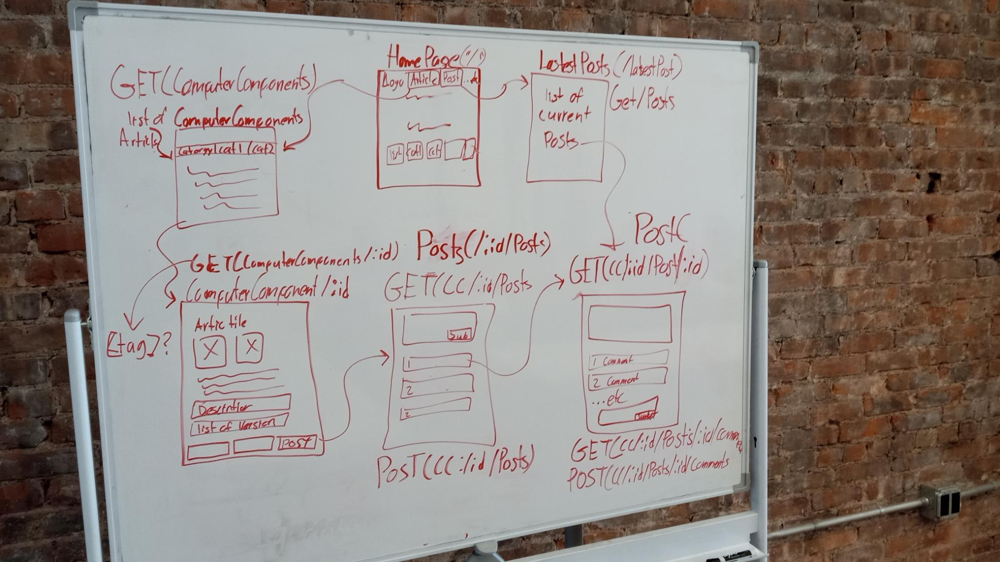
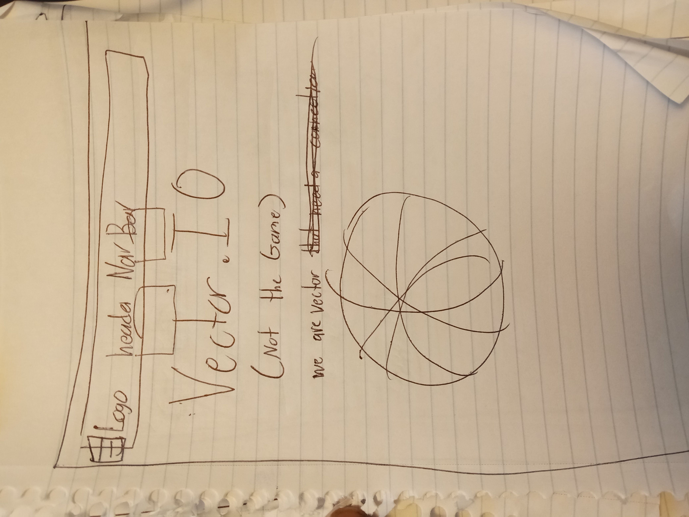
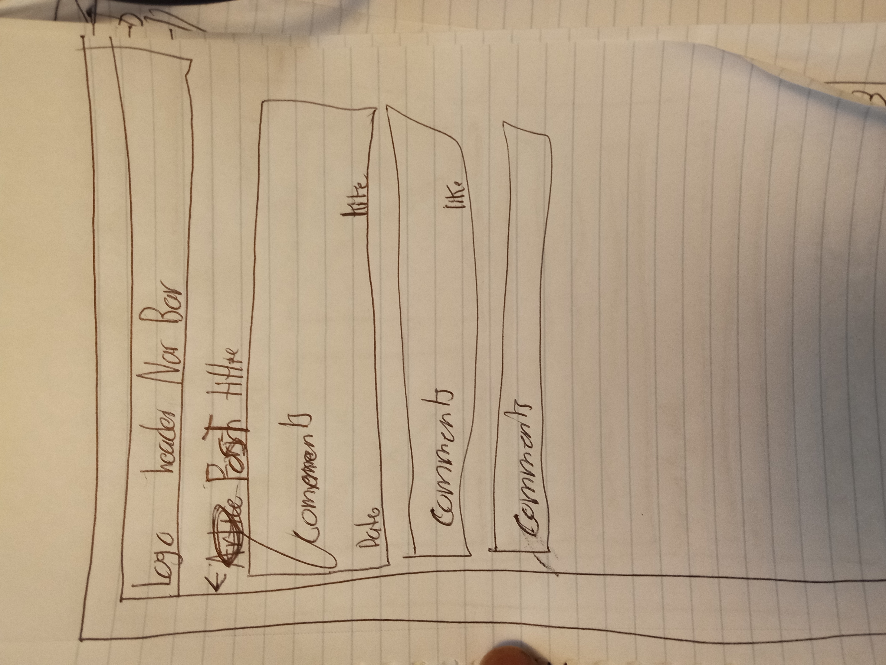
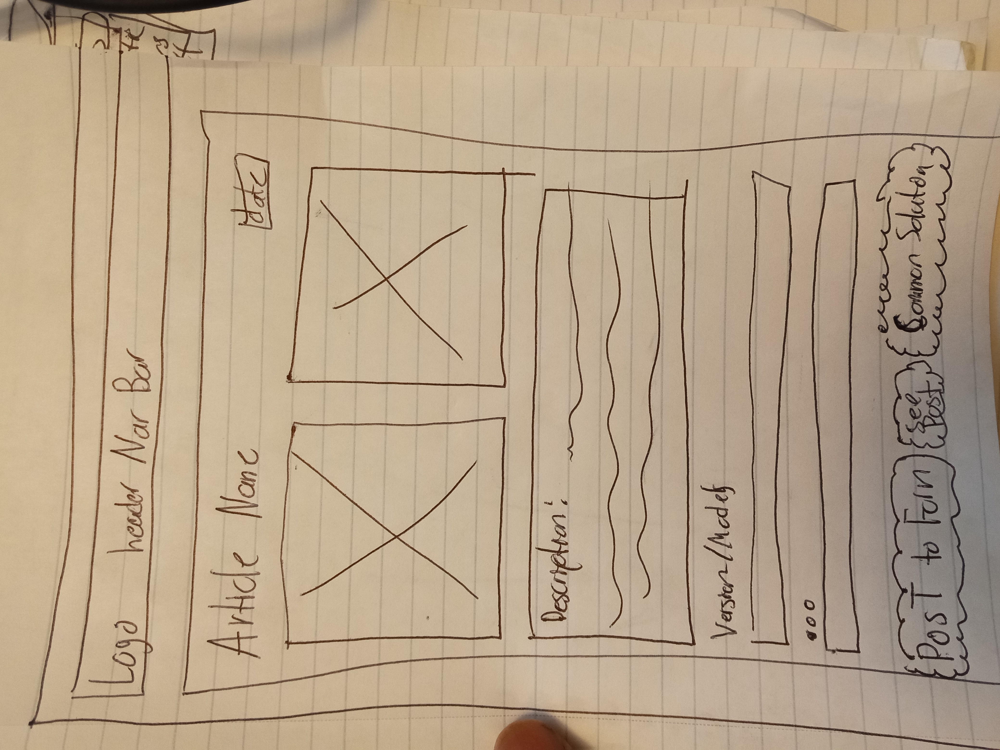
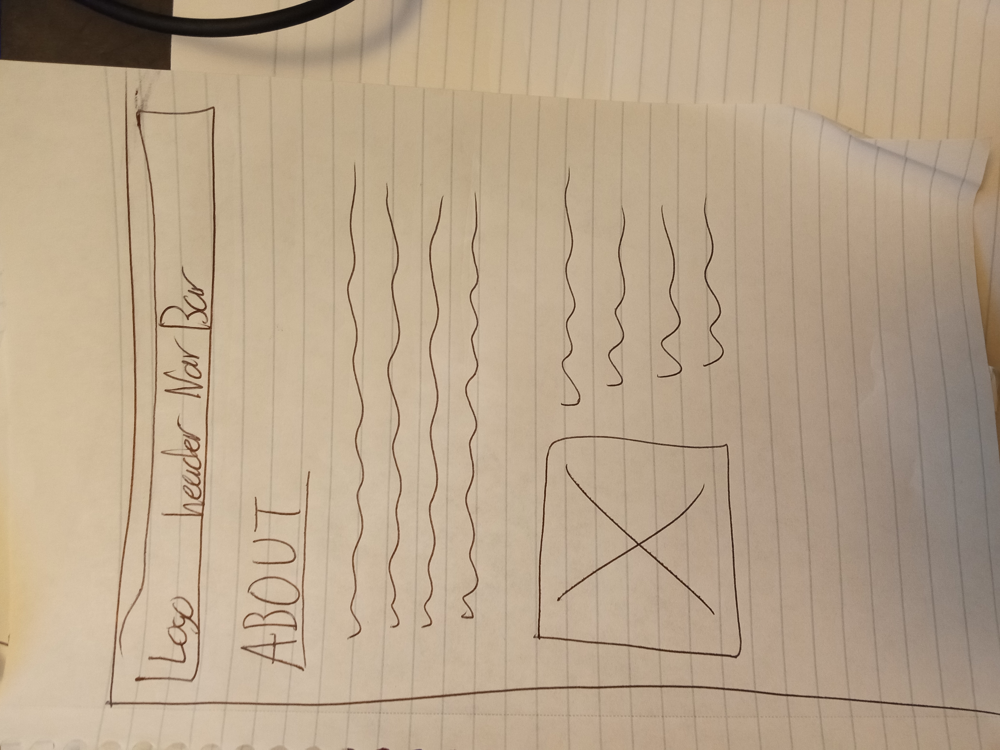
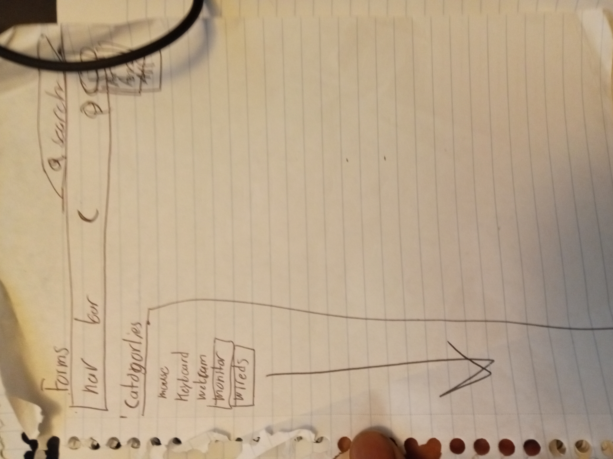

# Project Title
 VectorIO

## Overview

>What is your app? Give a brief description in a couple of sentences.

VectorIo is a website that will (as of right now) help tech people in IT departments like IT Help Desk, technicals, Relocation Technicians, IT support, and IT infrastructure. This website is made for quick and easy use with more common problems and information. Also if you have some not-so-common problems we do have forms that people can comment on and put their ideas together.

### Problem Space

>Why is your app needed? Give any background information about any pain points or other reasons.

Sometimes, when techs are looking for a solution to a problem, they have to do a lot of Google searching and click on another website. We are going to try to stop and also give information about the item, model, and version of that product to be more easily used.


### Features And User Profile

 As a user, I want to find articles, posts, or general information about computer hardware, accessories, wiring, software, OS, and other information. If I were to look at forms or articles or information I as a user should have the option to choose out of my search.

## Implementation

### Tech Stack

>List technologies that will be used in your app, including any
libraries to save time or provide more functionality. Be sure to 
research any potential limitations.

 React
 MySQL
 Express
 Client libraries:
 - react
 - react-router
 - Axios
 - (Maybe More)
 Server libraries:
 - knex
 - express
 - (Maybe More)
    

### APIs

>List any external sources of data that will be used in your app.
 I'm going to make my API.

 No external APIs, I'm making my own

### Sitemap

 > List the pages of your app with brief descriptions. You can show this visually, or write it out.

 HomePage ("/")
 ComputerComponnets ("/ComputerComponnets")
 ComputerComponnet("/ComputerComponnet/:id")
 Posts("/ComputerComponnet/:id/Posts")
 Post("/ComputerComponnet/:id/Post/:id")
 latestPost(/Posts)
 Abouts Page(/About)

 

### Mockups

Provide visuals of your app's screens. You can use pictures of hand-drawn sketches, or wireframing tools like Figma.

#### Home Page 


#### Post Page 


#### ComputerComponitePage 


#### About Page


#### Other Ideas Drawings


### Data

Describe your data and the relationships between the data points. You can show this visually using diagrams, or write it out. 

[Click Here for Diagram](https://drawsql.app/teams/who-5/diagrams/who)

### Endpoints

List endpoints that your server will implement, including HTTP methods, parameters, and example responses.

**Get /ComputerComponites**
- Get the List of ComputerComponites 

No Parameters

Response: 
```
[
 {
 "id": 1,
 "title": "Display Port Cable (DP)",
 "image": "dp.png",
 "gerernal_info": "A DisplayPort cable is used to connect a 
 computer or other device to a monitor or display device. It
 ....",
 "versionModel_id": 1,
 "update": "1223345432432",
 "category": "cable",
 "solution_id": 1;
 },
 {
 "id": 2,
 "title": "CAT5 (Ethernet Cable)",
 "image": "dp.png",
 "gerernal_info": "A DisplayPort cable is used to connect a 
 computer or other device to a monitor or display device. It
 ....",
 "versionModel_id": 2,
 "update": "1223345432432",
 "category": "cable",
 "solution_id": 2;
 }
 .........
]
```

**Get /ComputerComponite/:id**
-Get will get the ComputerComponite by id
Parameters:
- id: ComputerComponite id as a number

Response: 
```
[
 {
 "id": 1,
 "title": "Display Port Cable (DP)",
 "image": "dp.png",
 "gerernal_info": "A DisplayPort cable is used to connect a 
 computer or other device to a monitor or display device. It
 ....",
 "versionModel_id": 1,
 "update": "1223345432432",
 "category": "cable",
 "solution_id": 1;
 },
]
```
**Get /ComputerComponite/:id/VersionOrModels**
- Get will get the VersionORModel by looking at the VersionORModel ComputerComponite id which should be a list

Parameters:
- id: ComputerComponite id as a number and as well of the VersionORModel 
Response: 
```
[
 {
 "id": 1,
 "title": "Display Port Cable (DP)",
 "information": "VESA announced version 2.1 of the DisplayPort 
 standard on 17 October 2022. This version incorporates the
 new DP40 and DP80 cable certifications, which test 
 DisplayPort cables for proper operation at the UHBR10 
 (40  Gbit/s) and UHBR20 (80  Gbit/s) speeds introduced in 
 version 2.0. Additionally, it revises some of the electrical 
 requirements for DisplayPort devices in order to improve 
 integration with USB4."
 },
]
```
**Get /ComputerComponite/:id/solutions**
- Get will get the solutions by looking at the solutions ComputerComponite ID which should be a list

Parameters:
- id: ComputerComponite id as a number and as well of the id of the solution
Response: 
```
[
 {
 "id": 1,
 "solution": "1.  **Verify Correct Cable Connection**: 
 Ensure the DP cable is properly connected to both the 
 source device (computer, graphics card, etc.) and 
 the display. Make sure the cable is fully seated in 
 both ports."
 },
]
```
**Get /Posts**
- Get will get the list of Post

Parameters:
- id: Post id, Comment id, and ComputerComponite id as a number
Response: 
```
[
 {
 "id": 1,
 "ComputerComponite_id": 1,
 "comment_id": 1,
 "title": "Black screen with audio problem, I was trying to 
 fix the DP but it's not working",
 "Post Date": 45534546745,*-+
 },
]
```
**Post  /Posts**
- Post will post a post 

Parameters:
- id: Post id, Comment id, and ComputerComponite id as a number

Response: 
```
[
 {
 "id": 1,
 "ComputerComponite_id": 1,
 "comment_id": 1,
 "title": "Black screen with audio problem, I was trying to 
 fix the DP but it's not working",
 "Post Date": 45534546745,*-+
 },
]
```
**Get /Post/:id/Comments**
- Get will get the Comments for that specific post

Parameters:
- id: Post id, Comment id  as a number

Response: 
```
[
 {
 "id": 1,
 "post_id": 1,
 "text": "Have u tried to push it all the way in",
 "likes": 0
 },
]
```
**Post /Post/:id/Comments**
- Post will Post a comment on that Post

Parameters:
- id: Post id, Comment id  as a number

Response: 

```
[
 {
 "id": 1,
 "post_id": 1,
 "text": 1,
 "likes": 0
 },
]
```

**Put /Post/:id/Comments**
- put will change like a comment on that Post

Parameters:
- id: Post id, Comment id  as a number

Response: 

```
[
 {
 "likes": 1
 },
]
```


## Roadmap

>Scope your project as a sprint. Break down the tasks that will need to be completed and map out timeframes for implementation working back from the capstone due date. 

**Make and format the DB with data**
- Get data for a website and format that will be useful for the user and format  it 

**Create server**
- express project with routing

**Create migrations**

**Create seeds with sample  ComputerComponite, Posts, Comment, Solution, and VersionOrModel**

**Create client**
- react project with routes and pages

**Features**
- Home Page
- List/Nav/Page for the Category
 - User can have a Nav bar to see what category or make a Pagfe for it
- ComputerComponite Page when clicking the category and seeing the items and clicking on the items will give details about that item.
 - There will also be a list of solutions on that page
 - Also different versions or models with general info
- Post Page will give a list of Post
 - Post will be linked to the article and also link to the Comments section 
 - Comment will have a liking system
    
**Bugfixes**

**DEMO DAY**

## Future Implementations

>Your project will be marked based on what you committed to in the above document. Here, you can list any additional features you may complete after the MVP of your application is built, or if you have extra time before the Capstone due date.

- Login and Register User System
- More Data for Not only Computer Cable but Hardware, and Coding Computer Hardware
- Dislike Button 

